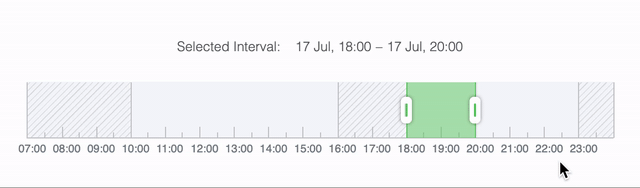

### react-timeline-range-slider

### Installation

     npm i react-timeline-range-slider
### Props

| Prop | Type | Default | Description|
|--|--|--|--|
| timelineInterval | array |[startOfToday(), endOfToday()]|Interval to display|
|selectedInterval|array|[new Date(), addHours(new Date(), 1)]|Selected interval inside the timeline|
|disabledIntervals|array|[]|Array of disabled intervals inside the timeline|
|containerClassName|string||ClassName of the wrapping container|
|step|number|48|Number of milliseconds between steps|
|ticksNumber|number|1800000|Number of steps on the timeline (the default value is 30 minutes)|
|error|bool|false|Is the selected interval is not valid|
|onUpdateCallback|function|||
|onChangeCallback|function|||
### Example
[Live demo](https://codesandbox.io/s/react-timeline-range-slider-ve7w2?file=/src/App.js)
```javascript
import React from 'react'  
import { endOfToday, format, set } from 'date-fns' 
import TimeRange from 'react-timeline-range-slider'  

const now = new Date()
const getTodayAtSpecificHour = (hour = 12) =>
	set(now, { hours: hour, minutes: 0, seconds: 0, milliseconds: 0 })

const selectedStart = getTodayAtSpecificHour()
const selectedEnd = getTodayAtSpecificHour(14)

const startTime = getTodayAtSpecificHour(7)
const endTime = endOfToday()

const disabledIntervals = [
  { start: getTodayAtSpecificHour(16), end: getTodayAtSpecificHour(17) },
  { start: getTodayAtSpecificHour(7), end: getTodayAtSpecificHour(12) },
  { start: getTodayAtSpecificHour(20), end: getTodayAtSpecificHour(24) }
]

class App extends React.Component {  
  state = {  
    error: false,  
    selectedInterval: [selectedStart, selectedEnd],  
  }
	
  errorHandler = ({ error }) => this.setState({ error })  

  onChangeCallback = selectedInterval => this.setState({ selectedInterval })  

  render() {  
    const { selectedInterval, error } = this.state  
      return (  
        <TimeRange
          error={error}  
          ticksNumber={36}  
          selectedInterval={selectedInterval}  
          timelineInterval={[startTime, endTime]}  
          onUpdateCallback={this.errorHandler}  
          onChangeCallback={this.onChangeCallback}
          disabledIntervals={disabledIntervals}  
        />
      )  
  }  
}  

export default App
```
